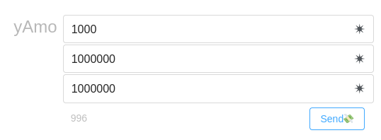
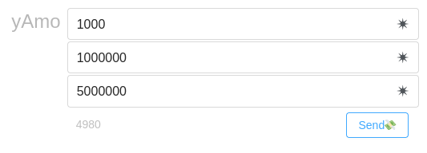
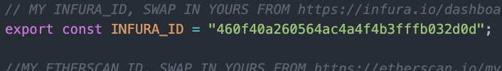
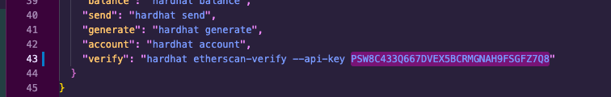

# 🏗 scaffold-eth | 🏰 BuidlGuidl

## 🚩 Challenge 5: ⚖️ Minimum Viable Exchange 

>This first killer app to be built on Ethereum was the token. A standard called ERC20 emerged and now anyone can deploy a token on Ethereum in seconds. Often, a token needs to be exchanged for value or another token and traditionally this has been facilitated by insecure centralized entities.

>In 2017, Vitalik Buterin proposed a method that would allow a smart contract to perform swaps between two assets using a liquidity ratio based on reserves eventually this became 🦄Uniswap. At the time being (May, 2022) the Uniswap contracts has passed a lifetime cumulative trading volume of $1 Trillion 🤯 - [Link to the tweet](https://twitter.com/Uniswap/status/1529102980296867842). Thankfully, my buddy Philippe Castonguay created uniswap-solidity and this tutorial will use a slimmed down version of this code.

>In this tutorial,we will build a decentralized exchange to swap an arbitrary token for ETH using a liquidity pool anyone can participate in. This build will demonstrate how smart contracts can create 🤖 automatic decentralized systems using crypto-economic incentives.

This readme is an updated version of the [original tutorial 📚](https://medium.com/@austin_48503/%EF%B8%8F-minimum-viable-exchange-d84f30bd0c90).

[support chat 💬](https://t.me/joinchat/q4WzoxX88nwzZmQx) to ask questions and find others dex builders 👷!

There is also a [Youtube video 🎥](https://www.youtube.com/watch?v=eP5w6Ger1EQ&t=364s&ab_channel=SimplyExplained) that may help you understand the concepts covered within this challenge too.

---
### ⛳️ Checkpoint 0: 📦 install 📚

```bash
git clone https://github.com/scaffold-eth/scaffold-eth-challenges.git challenge-5-dex
cd challenge-5-dex
git checkout challenge-5-dex
yarn install
```

---

### ⛳️ Checkpoint 1: 🔭 Environment 📺

You'll have three terminals up for:

`yarn start` (react app frontend)

`yarn chain` (hardhat backend)

`yarn deploy` (to compile, deploy, and publish your contracts to the frontend)

Navigate to the Debug Contracts tab and you should see two smart contracts displayed called `DEX` and `Balloons`.

> 👩‍💻 Rerun `yarn deploy` whenever you want to deploy new contracts to the frontend (run `yarn deploy --reset` for a completely fresh deploy if you have made no contract changes).

`Balloons.sol` is just an example ERC20 contract that mints 1000 to whatever address deploys it.

---

### ⛳️ Checkpoint 2: Liquidity 💦

We want to create an AMM(automatic market maker) where our contract will hold reserves of both ETH and 🎈 BAL. These reserves will provide liquidity that allows anyone to swap between the assets.

Before we start with the code, we need to understand a bit of the math we are using in the contracts. 

We define liquidity as: 


$$\sqrt{ethRes·tokRes}$$


It's useful to use the square root of the product because we obtain a linear function. Use only the product isn't a good idea because we get a quadratic function and since we are working with us (10^18) magnitude very crazy numbers could come out. Use the sum is not possible because it would be like add apples to oranges.

To track the liquidity we use a token ERC20, holding a certain quantity of this token will represent the possession of a share of the total liquidity of the pool.

Let’s add code to `DEX.sol`:

First, we are going to define an ERC20 Ownable token contract called LPEthToken, we have to import the ERC20 and Ownable libraries from openzeppelin. This contract has a function to mint and another to burn the tokens, the only address who can execute those functions is the owner address. Then in the constructor of our dex we are going to deploy this token contract so the owner of LPEthToken will be the Dex contract. We are also going to add a series of events to track trades and liquidity variations in the pool.


<details markdown='1'><summary>👩🏽‍🏫 Solution Code</summary>

```
pragma solidity >=0.8.0 <0.9.0;
// SPDX-License-Identifier: MIT
// import "hardhat/console.sol";
import "@openzeppelin/contracts/token/ERC20/IERC20.sol"; 
import "@openzeppelin/contracts/token/ERC20/ERC20.sol"; //<---Add library import
import "@openzeppelin/contracts/access/Ownable.sol"; //<---Add library import

//Add this contract definition
contract LPEthToken is ERC20, Ownable{
  constructor(string memory name, string memory symbol) ERC20(name, symbol){}

  function mint(address account, uint256 amount) public onlyOwner{
    _mint(account, amount);
  }
  function burn(address account, uint256 amount) public onlyOwner{
    _burn(account, amount);
  }
}

contract DEX {
  
  IERC20 token;
  LPEthToken public lpEthToken; //<---Define token variable
  
  //Add this events definitions
  event EthToTokenSwap(address swapper, string txDetails, uint256 ehtInput, uint256 tokenOutput);
  event TokenToEthSwap(address swapper, string txDetails, uint256 tokenInput, uint256 ehtOutput);
  event LiquidityProvided(address liquidityProvider, uint256 tokenInput, uint256 ethInput, uint256 liquidityMinted);
  event LiquidityRemoved(address liquidityRemover, uint256 tokenOutput, uint256 ethOutput, uint256 liquidityBurned);
  
  constructor(address token_addr) {
    token = IERC20(token_addr);
    lpEthToken = new LPEthToken("LPEthToken","LPDEX");//<---Deploy contract and set token varible
  }
 }
```

</details>

---

### ⛳️ Checkpoint 3: Pool initialization 🏊

Then, let’s create an init() function in `DEX.sol` that is payable and then we can define an amount of tokens that it will transfer to itself.

Calling init() will load our contract up with both ETH and 🎈 BAL at 1:1 ratio. init() checks if the pool is already initialized and if it's not, transfers ether and tokens from the user balance to de pool and mints LPEthToken directly in the user address. The initial quantity of LPEthToken to mint equals to the quantity of ether sent to initialize the pool.

<details markdown='1'><summary>🧮 Maths</summary>

* If we take the liquidity expression:

$$\sqrt{ethRes·tokRes}$$

* And the ratio asset ratio 1:1 in such a way that:

$$ethRes = initEth$$ 

* And:

$$tokRes = initTok = initEth$$

* Results: 

$$liquidityToMint = \sqrt{initEth^2} = \left|initEth \right| $$

</details>

<details markdown='1'><summary>👩🏽‍🏫 Solution Code</summary>

```
function init(uint256 tokens) public payable returns (uint256) {
  require(lpEthToken.totalSupply()==0, "DEX:init - already has liquidity");
  lpEthToken.mint(msg.sender,address(this).balance);

  require(token.transferFrom(msg.sender, address(this), tokens));
  return lpEthToken.totalSupply();
}
```

</details>

We can see that the DEX starts empty. We want to be able to call init() to start it off with liquidity, but we don’t have any funds or tokens yet. Find the `00_deploy_your_contract.js` file and uncomment the lines below and add your address to fund your account:

```
  // paste in your address here to get 10 balloons on deploy:
  // await balloons.transfer("YOUR_ADDRESS",""+(10*10**18));

  // paste in your address here to get 10 ethers on deploy:
  // const signerDeployer = await ethers.provider.getSigner(deployer);
  // const Txresult = await signerDeployer.sendTransaction({ to: "YOUR_ADRESS", value: ethers.utils.parseEther("10") });
```

Run `yarn deploy`. The front end should show you that you have balloon tokens. We can’t just call init() yet because the DEX contract isn’t allowed to transfer tokens from our account. We need to approve() the DEX contract with the Balloons UI.

🤓 Copy and paste the DEX address and then set the amount to 5000000000000000000 (5 * 10¹⁸). You can confirm this worked using the allowance() function. Now we are ready to call init() on the DEX. We will tell it to take (5 * 10¹⁸) of our tokens and we will also send 0.01 ETH with the transaction. You can see the DEX contract's value update and you can check the DEX token balance using the balanceOf function on the Balloons UI. 

This works pretty well, but it will be a lot easier if we just call the init() function as we deploy the contract. In the `00_deploy_your_contract.js` script try uncommenting the init section so our DEX will start with 3 ETH and 3 Balloons of liquidity:

```
  // uncomment to init DEX on deploy:
  // console.log("Approving DEX ("+dex.address+") to take Balloons from main account...")
  // If you are going to the testnet make sure your deployer account has enough ETH
  // await balloons.approve(dex.address, ethers.utils.parseEther('100'));
  // console.log("INIT exchange...")
  // await dex.init("" + (3 * 10 ** 18), {value:ethers.utils.parseEther('3'), gasLimit:200000})
```

Now when we `yarn deploy --reset` then our contract should be initialized as soon as it deploys and we should have equal reserves of ETH and tokens.

---

### ⛳️ Checkpoint 4: Price variation 🤑

Now that our contract holds reserves of both ETH and tokens, we want to use a simple formula to determine the exchange rate between the two. We are building an constant product AMM, that means that during the trades the product `K` has to be kept constant.

We are just swapping one asset for another, the “price” is the relation between assets, and we can see in the math demonstration that the invariation of the product forces that the price depends on the context of the trade (Quantity of assets traded, and the ratio between assets reserved in the pool).

<p align="center" >
 
</p>

A market based on a curve like this will always have liquidity, but as the ratio becomes more and more unbalanced, you will get less and less of the less-liquid asset from the same trade amount. Again, if the smart contract has too much ETH and not enough BAL tokens, the price to swap BAL tokens to ETH should be more desirable (BAL is more "cheap").

We need a function to calculate how much of the resulting output asset you will get if you put in a certain amount of the input asset for a determinate ratio of assets in de pool. 

Try to edit your DEX.sol smart contract and bring in that function!

<details markdown='1'><summary>🧮 Maths</summary>

* We have the following equations that define the behavior of the trades, note that a 0,3% fee are deduced from the input asset:


$$xRes·yRes = K$$


$$(xRes + xAmo·99,7\\%)·(yRes - yAmo) = K$$


* Combinating both equations we get:


$$(xRes + xAmo·\frac{997}{1000})·(yRes - yAmo) = xRes·yRes$$


$$ xRes·yRes - xRes·yAmo + xAmo·\frac{997}{1000}·yRes - xAmo·\frac{997}{1000}·yAmo = xRes·yRes $$

$$ xRes·yAmo + xAmo·\frac{997}{1000}·yAmo = xAmo·\frac{997}{1000}·yRes$$


$$ yAmo · \left ( xRes + xAmo·\frac{997}{1000} \right ) =  xAmo·\frac{997}{1000}·yRes $$


$$ yAmo = \frac{xAmo·\frac{997}{1000}·yRes}{xRes + xAmo·\frac{997}{1000}} = \frac{xAmo·997·yRes}{xRes·1000 + xAmo·997} $$

</details>

<details markdown='1'><summary>👩🏽‍🏫 Solution Code</summary>

```
function yAmo(uint256 xAmo, uint256 xRes, uint256 yRes) public pure returns (uint256){ 
 return xAmo*997*yRes/(xRes*1000+xAmo*997); 
}
```

</details>

Let’s deploy this and poke around:

```

yarn run deploy

```

Let’s say we have 1 million ETH and 1 million tokens, if we put this into our price formula and ask it the price of 1000 ETH it will be an almost 1:1 ratio:

<p align="center" >
 
</p>

If we put in 1000 ETH we will receive 996 tokens. If we’re paying a 0.3% fee it should be 997 if everything was perfect. BUT, there is a tiny bit of slippage as our contract moves away from the original ratio. Let’s dig in more to really understand what is going on here. Let’s say there is 5 million ETH and only 1 million tokens. Then, we want to put 1000 tokens in. That means we should receive about 5000 ETH:

<p align="center" >
 
</p>

Finally, let’s say the ratio is the same but we want to swap 100,000 tokens instead of just 1000. We’ll notice that the amount of slippage is much bigger. Instead of 498,000 back we will only get 453,305 because we are making such a big dent in the reserves.

<p align="center" >
 
</p>

❗️ The contract automatically adjusts the price as the ratio of reserves shifts away from the equilibrium. For this reason it is called it’s called an 🤖 Automated Market Maker (AMM).


#### 🥅 Goals / Checks
- [ ] 🤔 Do you understand how the x*y=k price curve actually works? Write down a clear explanation for yourself and derive the formula for price. You might have to shake off some old algebra skills!

- [ ] 💃 You should be able to go through the price section of this tutorial with the sample numbers and generate the same outputChange variable.

>💡 Hints: See this link, solve for the change in the Output Reserve. See the section in that link up to the uniswap v3 title.

>💡💡 More Hints: Also, don't forget to think about how to implement the trading fee. Solidity doesn't allow for decimals, so one way that contracts are written to implement percentage is using whole uints (997 and 1000) as numerator and denominator factors, respectively.

---

### ⛳️ Checkpoint 5: Trading 🤝

Let’s edit the DEX.sol smart contract and add two new functions for swapping from each asset to the other, `ethToToken()` and `tokenToEth()`!

Each of these functions should calculate the resulting amount of output asset using the function built in the previous checkpoint. We can call tokenToEth and it will take our tokens and send us ETH or we can call ethToToken with some ETH in the transaction and it will send us BAL tokens.

<details markdown='1'><summary>👩🏽‍🏫 Solution Code</summary>

```
function ethToToken() public payable returns (uint256){
 require(msg.value > 0, "cannot swap 0 ETH");
 //Reserve calculation
 uint256 tokenReserve = token.balanceOf(address(this));
 uint256 ethReserve= address(this).balance - msg.value;
 //Trade execution
 uint256 tokensBought = yAmo(msg.value, ethReserve, tokenReserve);
 require(token.transfer(msg.sender,tokensBought),"ethToToken(): reverted swap.");
 emit EthToTokenSwap(msg.sender, "Eth to Ballons", msg.value, tokensBought);
 return tokensBought;
 }
 
 
 function tokenToEth(uint256 tokens) public returns (uint256){
  require(tokens > 0, "cannot swap 0 tokens");
  //Reserve calculation
  uint256 tokenReserve = token.balanceOf(address(this));
  uint256 ethReserve= address(this).balance;
  //Trade execution
  uint256 ethBought = yAmo(tokens, tokenReserve, ethReserve);
  (bool sent, ) = msg.sender.call{value: ethBought}("");
  require(sent, "tokenToEth(): failed to send user eth.");
  require(token.transferFrom(msg.sender, address(this), tokens), "tokenToEth(): reverted swap.");
  emit TokenToEthSwap(msg.sender, "Ballons to ETH", ethBought, tokens);
  return ethBought;
 }
```

</details>

Let’s deploy our contract then move over to the frontend. Exchange some ETH for tokens and some tokens for ETH!

### ⛳️ Checkpoint 6: Adding and removing Liquidity 🌊

So far, only the `init()` function controls liquidity. To make this more decentralized, it would be better if anyone could add to the liquidity pool by sending the DEX both ETH and tokens at the correct ratio. A liquidity deposit/withdraw does not have to have an impact on the price, so the relation between two assets have to stay constant when we deposit/withdraw liquidity, this sets a relation between increased/decreased ammounts.

<details markdown='1'><summary>🧮 Maths</summary>

* We define the price as:

$$ p = \frac{tokRes}{ethRes} = \frac{tokRes + \Delta tok}{ethRes + \Delta eth} $$

* So:

$$  \frac{tokRes}{ethRes}·\left (  ethRes + \Delta eth \right ) = tokRes + \Delta tok $$

$$  tokRes + \frac{tokRes·\Delta eth }{ethRes} = tokRes + \Delta tok $$

$$  \Delta tok = \Delta eth · \frac{tokRes}{ethRes}$$

</details>


Let’s create two new functions that let us deposit and withdraw liquidity, remember that you have to track the liquidity additions/decrements by minting/buring LPEthToken tokens. How would you write this function out? Try before taking a peak!

<details markdown='1'><summary>🧮 Maths</summary>

* The equation that defines the relation between the liquidity addition/decrement and the shares to mint:

$$ \frac{\sqrt{\left ( ethRes + \Delta eth\right )· \left ( tokRes + \Delta tok \right )}}{\sqrt{ethRes·tokRes}} = \frac{T_s + \Delta s}{T_s} $$

* Where $T_s$ are the total shares minted and $s$ are the shares to mint/burn resulting of the liquidity addition/decrement, so:

$$ \Delta s = \left ( \frac{\sqrt{\left ( ethRes + \Delta eth\right )· \left ( tokRes + \Delta tok \right )}}{\sqrt{ethRes·tokRes}} · T_s \right ) - T_s $$

$$ \Delta s = \left ( \frac{\sqrt{\left ( ethRes + \Delta eth\right )· \left ( tokRes + \Delta tok \right )} - \sqrt{ethRes·tokRes}}{\sqrt{ethRes·tokRes}}  \right ) · T_s $$

$$ \Delta s = \frac{\sqrt{ ethRes · tokRes + \Delta eth · \Delta tok  + \Delta eth · tokRes + ethRes · \Delta tok } - \sqrt{ethRes·tokRes}}{\sqrt{ethRes·tokRes}} · T_s $$

* If we use the $\Delta tok$ expression calculated previously:

$$ \Delta s =  \frac{\sqrt{ ethRes · tokRes + \left (   \Delta eth  \right )^2 · \frac{tokRes}{ethRes}  + 2· \Delta eth · tokRes} - \sqrt{ethRes·tokRes}}{\sqrt{ethRes·tokRes}}  · T_s $$

$$ \Delta s =  \frac{\sqrt{ tokRes · \left ( ethRes +  · \frac{\left (   \Delta eth  \right )^2}{ethRes}  + 2 · \Delta eth \right )} - \sqrt{ethRes·tokRes}}{\sqrt{ethRes·tokRes}}  · T_s $$

$$ \Delta s =  \frac{\sqrt{ \frac{ tokRes}{ethRes} · \left ( \left (   ethRes  \right )^2 + \left (   \Delta eth  \right )^2 + 2 · \Delta eth · ethRes \right )} - \sqrt{ethRes·tokRes}}{\sqrt{ethRes·tokRes}}  · T_s $$

$$ \Delta s =  \frac{\sqrt{ \frac{ tokRes}{ethRes} · \left ( ethRes +  \Delta eth \right )^2} - \sqrt{ethRes·tokRes}}{\sqrt{ethRes·tokRes}}  · T_s $$

$$ \Delta s =  \frac{ \frac{ 1 }{\sqrt{ethRes} }· \left ( ethRes +  \Delta eth \right ) - \sqrt{ethRes}}{\sqrt{ethRes}}  · T_s $$

$$ \Delta s =  \frac{  ethRes +  \Delta eth  - ethRes}{ethRes}  · T_s $$ 

$$ \Delta s =  \frac{\Delta eth}{ethRes}  · T_s $$ 


</details>


>💡 Hints: The `deposit()` function receives ETH and also transfers BAL tokens from the caller to the contract at the right ratio. The contract also tracks the amount of liquidity minting LPEthToken tokens.


<details markdown='1'><summary>👩🏽‍🏫 Solution Code deposit()</summary>

```
function deposit() public payable returns (uint256) {
 //Reserve calculation
 uint256 tokenReserve = token.balanceOf(address(this));
 uint256 ethReserve= address(this).balance - msg.value;
 //Liquidity deposit
 uint256 tokenAmount = (msg.value*tokenReserve)/ethReserve;
 require(token.transferFrom(msg.sender, address(this),tokenAmount));
 //share token minting
 uint256 liquidityMinted = (msg.value*lpEthToken.totalSupply())/ethReserve;
 lpEthToken.mint(msg.sender,liquidityMinted);
 emit LiquidityProvided(msg.sender, liquidityMinted, msg.value, tokenAmount);
 return liquidityMinted;
}
```

</details>


>💡 Hints: The `withdraw()` function lets a user take both ETH and BAL tokens out at the correct ratio. The actual amount of ETH and tokens a liquidity provider withdraws could be higher than what they deposited because of the 0.3% fees collected from each trade. It also could be lower depending on the price fluctuations of BAL to ETH and vice versa (from token swaps taking place using your AMM!). The 0.3% fee incentivizes third parties to provide liquidity, but they must be cautious of Impermanent Loss (IL).


<details markdown='1'><summary>👩🏽‍🏫 Solution Code withdraw()</summary>

```
function withdraw(uint256 liqAmount) public returns (uint256, uint256){
 //Reserve calculation
 uint256 tokenReserve = token.balanceOf(address(this));
 uint256 ethReserve = address(this).balance;
 uint256 totaLiq = lpEthToken.totalSupply();
 //Liquidity withdraw
 uint256 tokenAmount = (tokenReserve*liqAmount)/totaLiq;
 uint256 ethAmount = (ethReserve*liqAmount)/totaLiq;
 require(token.transfer(msg.sender,tokenAmount));
 (bool sent, ) = msg.sender.call{value: ethAmount}("");
 require(sent, "Failed to send user eth.");
 //share token burning
 lpEthToken.burn(msg.sender,liqAmount);
 emit LiquidityRemoved(msg.sender, liqAmount, ethAmount, tokenAmount);
 return(tokenAmount,ethAmount);
}
```
</details>


Remember that you will need to call `approve()` from the `Balloons.sol` contract approving the DEX to handle a specific number of your BAL tokens. To keep things simple, you can just do that when interacting with the UI or debug tab with your contract.

🚨 Take a second to understand what these functions are doing if you pasted them into your DEX.sol file in packages/hardhat/contracts.

#### 🥅 Goals / Checks

- [ ] 💧 Deposit liquidity, and then check your liquidity amount through the lpEthToken total supply, you can connect metamask to your frontend and import the token contract too. Has it changed properly? Did the right amount of assets get deposited?

- [ ] 🧐 What happens if you `deposit()` at the beginning of the deployed contract, then another user starts swapping out for most of the balloons, and then you try to withdraw your position as a liquidity provider? Answer: you should get the amount of liquidity proportional to the ratio of assets within the isolated liquidity pool. It will not be 1:1.

---

### ⛳️ Checkpoint 7: UI 🖼

Cool beans! Your front-end should be showing something like this now!

<p align="center" >
 
</p>

Now, a user can just enter the amount of ETH or tokens they want to swap and the chart will display how the price is calculated. The user can also visualize how larger swaps result in more slippage and less output asset.

🥅 Extra Challenge:
 - [] `approve()` event emission: can you implement this into the event tabs so that it is clear when approve() from the Balloons.sol contract has been executed?
 
---
 
### ⛳️ Checkpoint 8: 💾 Deploy it! 🛰


📡 Edit the `defaultNetwork` in `packages/hardhat/hardhat.config.js`, as well as `targetNetwork` in `packages/react-app/src/App.jsx`, to [your choice of public EVM networks](https://ethereum.org/en/developers/docs/networks/)

#### 🔶 Infura

> You will need to get a key from infura.io and paste it into constants.js in packages/react-app/src:

<p align="center" >
 
</p>

👩‍🚀 You will want to run `yarn account` to see if you have a deployer address.

🔐 If you don't have one, run `yarn generate` to create a mnemonic and save it locally for deploying.

🛰 Use an [instantwallet.io](https://instantwallet.io/) to fund your deployer address (run `yarn account` again to view balances).

>🚀 Run yarn deploy to deploy to your public network of choice (😅 wherever you can get ⛽️ gas)

🔬 Inspect the block explorer for the network you deployed to... make sure your contract is there.

👮 Your token contract source needs to be verified... (source code publicly available on the block explorer)

---

### ⛳️ Checkpoint 9: 📜 Contract Verification

Update the api-key in packages/hardhat/package.json file. You can get your key [here](https://etherscan.io/myapikey).

<p align="center" >
 
</p>

>Now you are ready to run the `yarn verify --network your_network` command to verify your contracts on etherscan 🛰

This will be the URL you submit to [SpeedRun](https://speedrunethereum.com/).

---

### ⛳️ Checkpoint 10: 🚢 Ship it! 🚁

📦 Run `yarn build` to package up your frontend.

💽 Upload your app to surge with `yarn surge` (you could also `yarn s3` or maybe even `yarn ipfs`?)


> 💬 Problems, questions, comments on the stack? Post them to the [🏗 scaffold-eth developers chat](https://t.me/joinchat/F7nCRK3kI93PoCOk)

🚔 Traffic to your url might break the [Infura](https://infura.io/) rate limit, edit your key: `constants.js` in `packages/ract-app/src`.

