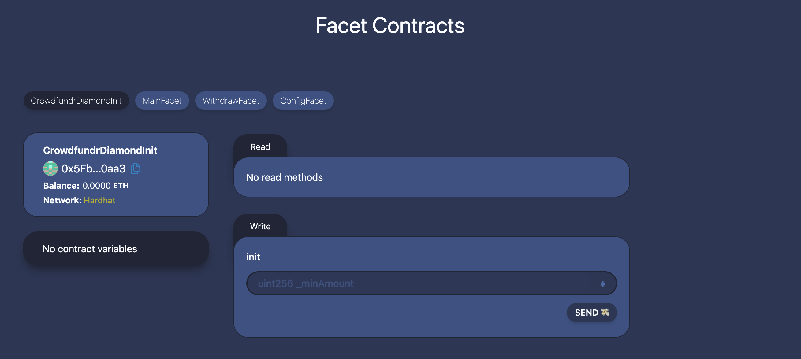
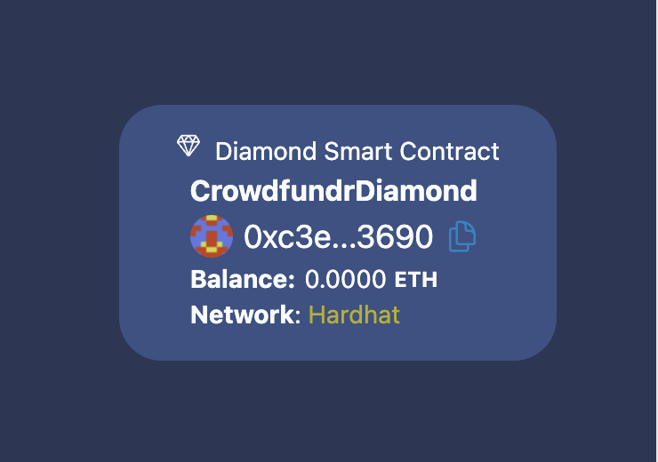

## 🚩 Challenge 8: Diamond Challenge - Crowdfunding 💎

> 🎰 Smart contract development can get quite complex if you have tons of contract logic to maintain. The Diamond standard (EIP-2535) makes it easy to modularize and efficiently upgrade and manage your smart contracts. You can read more about it [here](https://eips.ethereum.org/EIPS/eip-2535)

> We believe that at some point Diamonds will be standarized and used in different kinds of applications i.e. Smart Contract Wallets ERC4337, a hot topic recently

> Sidenote : Crowdfunding contracts have different features and there are many implementations out there, in this Challenge you will write your own Crowdfunding system using diamonds and facets, you will run into some problems where diamonds and facets will become handy and hopefully you get a better understanding of how this standard works

> We will start with a basic crowdfunding contract that allows users to contribute and the owner to claim the funds any time they want.

> 😱 Seems like contributors will never be able to get their money back, your role is to fix this and set up some conditions and add some functionalities to your crowdfunding contract.

> 💬 Meet other builders working on this challenge and get help in the [Challenge 8 telegram](https://t.me/+HjB0rEJ_98oxYzIx)!

---

### Checkpoint -1 : 📦 install 📚

Want a fresh cloud environment? Click this to open a gitpod workspace, then skip to Checkpoint 1 after the tasks are complete.

[](https://gitpod.io/#https://github.com/scaffold-eth/scaffold-eth-challenges/tree/challenge-8-diamond-pattern)

```bash
git clone https://github.com/scaffold-eth/scaffold-eth-challenges.git challenge-8-diamond-pattern
cd challenge-8-diamond-pattern
git checkout challenge-8-diamond-pattern
yarn install
```

---

### Checkpoint 0: 🔭 Environment 📺

You'll have three terminals up for:

```bash
yarn chain   (hardhat backend)
yarn start   (react app frontend)
yarn deploy  (to compile, deploy, and publish your contracts to the frontend)
```

> 👀 Visit your frontend at http://localhost:3000

> Please have an updated version of node  >=18.0.0
```bash
//check node version - make sure is at least 18.0.0
node -v
```
## **IMPORTANT : Redeploy**👩‍💻 

Rerun `yarn deploy --reset` whenever you want to deploy new contracts to the frontend.

**NOTE**

> This will setup a basic Crowdfunding Diamond that only allows users to `contribute` and the owner to `claim`.

### **you can inspect your diamond by clicking on `debug diamond`, the list of facets added to it will be displayed in this way**



### **you can see your diamond as a floating point on the right side or on the top**



## Checkpoint 1: 💸 Contribute some ETH

🔍 Inspect the code in the `MainFacet` contract in `packages/hardhat/contracts/facets`

🔍 Inspect the code in the `CrowdFundDiamondInit` contract in `packages/hardhat/contracts`

💸 Grab some funds from the faucet and try sending some ETH to the crowdfunding


**STEPS TO REPRODUCE**

- Let's start by sending 1 ETH

    - Can you guess why is this happening ?

    - This wont work so your **TASK 1** is to change the minimum `contribution amount` in TODO: line inside `01_checkpoint.ts`.

- After you are done with this part : run `yarn deploy --reset`

    - you should be now able to `contribute` 1 ETH

- As the owner you should be able to `claim()` all the funds added to this contract


### 🥅 **Goals**

- [✅] Understand how the initalization of a diamond works
- [✅] Get acquainted with the essential setup of Diamonds.

---

## Checkpoint 2: 🙏 Lets be fair to the contributors

Contributors have started to complain if they can actually take their money back from the Crowdfundr contract, the owner can take the money but the contributors' money is locked.

🔍 Inspect the code in the `WithdrawFacet.sol` contract in `packages/hardhat/contracts/facets`, specially look at the function `refund()`

- Start by commenting out the `return` line in the code at `02_checkpoint.ts`, this will run the script contained in this file.

- 🔍 Inspect the code in the `02_checkpoint.ts` inside `packages/hardhat/deploy`, specially understand how a facet is added to the Diamond

- At this point your contributors should be able to get the funds back by calling the `refund` function in `WithdrawFacet`

    - Can you guess whats wrong here?

### ⚔️ Checkpoint 2 side quests

In a crowdfunding contract, usually the contributors will be able to `refund()` their amount after the deadline has passed. So lets set a deadline and enforce it inside the function `refund()`

- [x] call `setDeadline(VALUE)` at the bottom of `02_checkpoint.ts`, the value passed is in seconds, lets set it to 120 Seconds.

- [x] Uncomment the code that enforces deadline to have passed, inside `refund()` in `WithdrawFacet.sol`.

- [x] Redeploy 

- [x] within 2 minute try contributing some ETH and call `refund` , see if `refund` function fails until the 2 minute has passed from deployment

---

## Checkpoint 3: 💵 Claiming when goal amount has been reached

Ok, so at this point your contributors can `contribute` and `refund` their assets when the deadline has been reached. But there should be some rules for the owner, owner can only withdraw if the goal has been reached. Likewise, contributors only would be able to `refund` if the goal hasn't been reached

🔍 Inspect the code in the `ConfigFacet.sol` contract in `packages/hardhat/contracts/facets`

- Start by commenting out the `return` line in the code at `03_checkpoint.ts`, in the same way the facet was added in `02_checkpoint.ts`, try adding the last facet : `ConfigFacet`

- [x] Inside `MainFacet.sol` enforce that deadline has been reached inside the `claim()` function

- [x] Inside `WithdrawFacet.sol` enforce that goal has been reached inside the `refund()` function, likewise for `claim()` inside `MainFacet.sol`

- [x] Inside `03_checkpoint.ts` , call target amount to set the value. Lets try 10 ETH.

### 🥅 Goals

- [✅] Test out the contract, do all your functions work as expected
- [✅] Interact and play around with the facets, get acquainted with their functions

---
## ⚔️ Side Quest

- [✅] Check the tests

### **Close the chain terminal and open 2 new ones**

```bash
yarn chain
```

```bash
yarn hardhat:test
```

## Checkpoint 4: 💾 Deploy it! 🛰

> 📡 Edit the `defaultNetwork` in `packages/hardhat/hardhat.config.js`, as well as `targetNetwork` in `packages/nextjs/scaffold.config.ts`, to [your choice of public EVM networks](https://ethereum.org/en/developers/docs/networks/)

> 👩‍🚀 Create an `.env` file inside `packages/hardhat`

```bash
cd packages/hardhat
cp .env.example .env
```
> ✏️ Fill in the required fields in `.env` file inside

```bash
RPC= 
// any rpc for the network you want to deploy to

DEPLOYER_PRIVATE_KEY= 
// your TEST account private key, must have funds in the network you want to specify

ETHERSCAN_API_KEY= 
// a key that will allow you to verify your contracts
```
> 🤔 add the `RPC` to the corresponding network in hardhat.config.js
```javascript
    polygonMumbai: {
      url: process.env.MUMBAI_RPC,
      accounts: [deployerPrivateKey],
    },
```
> 🚀 Run `yarn deploy` to deploy to your public network of choice (😅 wherever you can get ⛽️ gas)

🔬 Inspect the block explorer for the network you deployed to... make sure your contract is there.

---

## Checkpoint 6: 🚢 Ship it! 🚁

- 📦 Create a Vercel account if you dont have one

- 🙌🏾 Deploy your project using vercel , follow the instructions after the command
```bash
yarn vercel
```
- ䷄ Wait until your project is deployed and shill the link into the telegram chat
---

## Checkpoint 7: 📜 Contract Verification

- Update the `ETHERSCAN_API_KEY` in `.env`

- Now you are ready to run the `yarn verify --network your_network` command to verify your contracts on etherscan 🛰

Copy the verified address for your CrowdfundrDiamond contract and enter that into the appropriate Etherscan testnet.

---
## Final Side Quest: 📕 Inspect / upload your Diamond & Facets

- upload your Facet to [`facets.wiki`](https://facets.wiki/) so that others will be able to reuse it 

